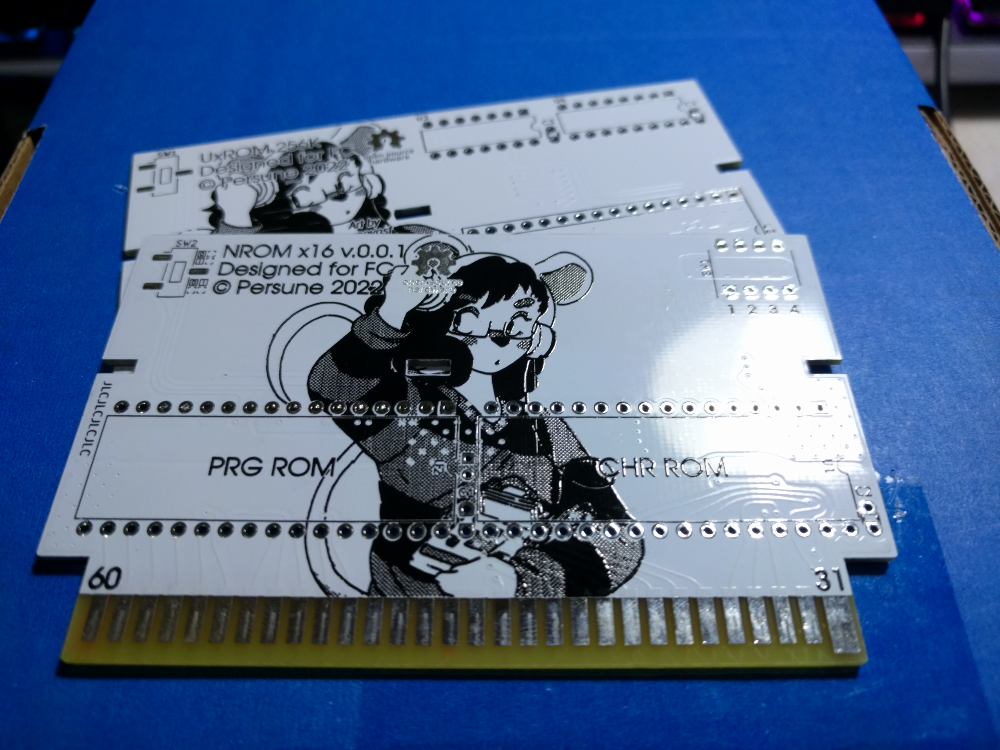

# NES-Famicom-Cartridge-PCBs

 
 
 this is where i make the famicom cartridge PCBs
 
 All cartridge PCBs are licenced under the TAPR Open Hardware License.
 All software tools distributed with each project are licensed under the MIT-0 License.
 
 ## Support

If you enjoy this project or find it helpful, please support me on [Ko-Fi](https://ko-fi.com/persune) or [Patreon](https://www.patreon.com/persune)!
